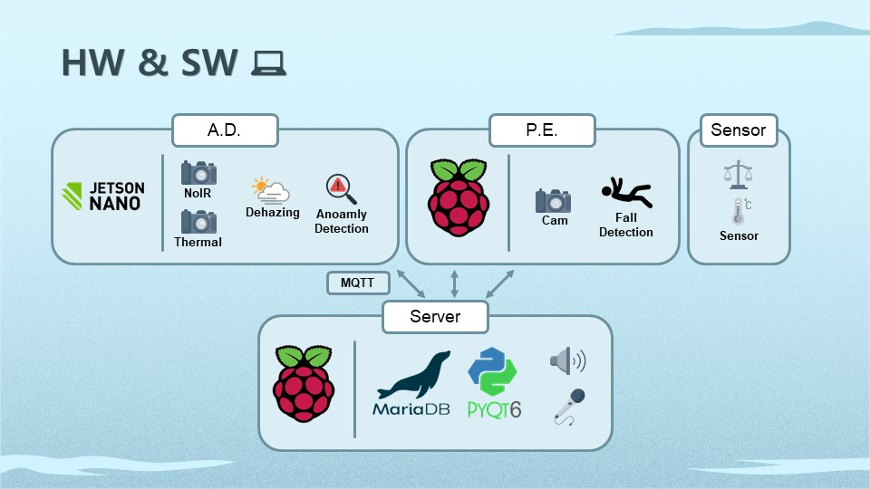
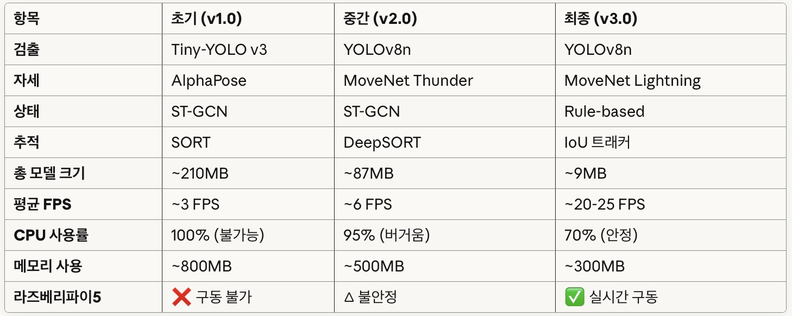
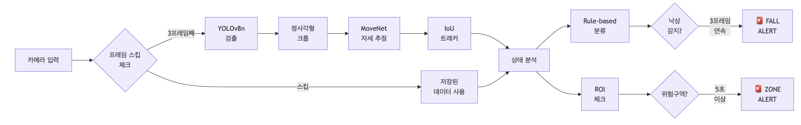

# CTRL SEA CTRL VISION

## 1. 프로젝트 소개
> ### **AI 기반 선박 제어실 보조 On-Device 시스템**
본 프로젝트는 **AI 기반 컴퓨터 비전 기술**을 활용하여 해상 환경에서 선박 항해 안전성과 효율 향상을 위한 **선박 제어실 보조 On-Device 시스템**입니다. 이 시스템은 **안개 속 객체를 실시간으로 탐지**하고, **이상을 감지**하며, **객체 추적**, **자세 추정**기술로 선체 안전과 선원 보호를 도모합니다. 또한, **LLM**을 활용하여 **자동 항해 일지 작성과 브리핑**을 제공합니다. 시스템의 핵심 기능으로는 **안개 제거, 이상 감지, 낙상 감지, 자동 항해 일지 작성** 등이 포함됩니다.

### 주요 기능
- **안개 너머 객체 탐지 및 이상 감지**  
- **선원 안전 확보**  
- **자동 항해 일지 작성 및 브리핑**

### 전체 시스템 구상도

**개발 기간**: 2025.09.26 ~ 2025.10.22  
**개발 환경**: Jetson Nano / Raspberry Pi 5 / Python / MQTT  
**발표 자료 다운로드**: [[Ctrl + Click Here]](https://drive.google.com/drive/folders/1VzminDn5eenhiwE3JjTkIos7xjNJQT3j?usp=sharing)

## 2. 안개 제거 Dehazing

> ### **이미지 향상(Image Enhancement) 및 복원(Image Restoration)을 통한 시야 확보**

## 3. 이상 감지 Anomaly Detection

### 🛰 이상 감지 학습 방식

## 4. 낙상 감지 Fall Detection

  
  

 

## 5. 상황실 Ctrl Room

### 🛰 MQTT 통신 구조

## 6. 팀원 소개
| 이름 | 담당 |
|------|------|
| **문두르** | PM |
| **류균봉** | Image Enhancement / Dehazing |
| **나지훈** | Server / MQTT / GUI / LLM / STT / TTS |
| **김찬미** | Pose Estimation / Fall Detection |
| **이환중** | Object Detection / Anomaly Detection |
